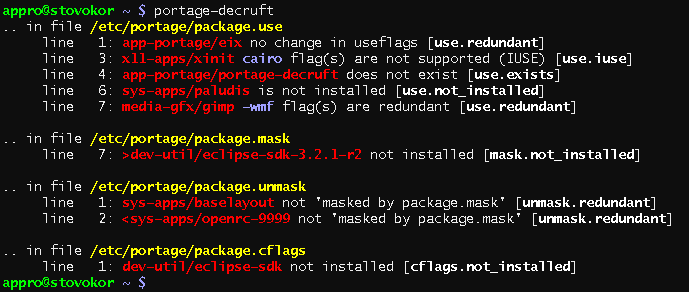

======================================
portage-decruft - decruft /etc/portage
======================================

The current version is portage-decruft-0.1.5-r4_. A ChangeLog_ is also available.
Old versions are available from the releases_ directory.

.. _releases: releases/
.. _portage-decruft-0.1.5-r4: releases/portage-decruft-0.1.5-r4
.. _ChangeLog: ChangeLog.txt

.. contents:: :local:

portage-decruft checks your configuration in /etc/portage (*package.keywords*,
*package.mask*, *package.unmask* and *package.use*) and reports on any
redundant, obsolete or irrelevant entries. It is possible to ignore specific
lines or whole blocks in the files, see `Ignoring lines`_.

We also currently check the files `/etc/portage/package.cflags`,
`/etc/portage.cxxflags`, `/etc/portage.ldflags` and `/etc/portage.features`.
But since these files do not have a standard syntax, there is no way to
implement a generic check for redundancy of the settings. Because of this,
portage-decruft only checks the atoms for the basic `Generic Issues`_.

portage-decruft has a list of so called `issues` which are checked for each
file (SEE `Understanding the output`_). By default all issues are considered,
but you may exclude and include issues by using the ``--disable LIST`` and
``--enable LIST`` options.

portage-decruft does **read-only** operations and will **not edit** your
system configuration by itself.

    portage-decruft showing some issues for package.{use, mask,unmask,cflags}.

Usage
=====

**portage-decruft** [`OPTIONS`]

Options
+++++++

::

    -l, --list-issues   Show all available issues.

    -e, --enable LIST   Enable the listed issues. Use ',' as separator.
                        ``*.exists`` and ``keywords.*`` will work as expected.

    -d, --disable LIST  Disable the listed issues. Use ',' as separator.
                        ``*.exists`` and ``keywords.*`` will work as expected.

    -C, --no-color      Do not colorize output.

    -V, --version       Print version string.

    -h, --help          Show short help text.

Available `Issues`
==================

In the terminology of this script, `issues` are the checks that are performed
on the files. 

The names of the `issues` are made up from the suffix of the file and a unique
name describing the `issue`. For example, the file `package.keywords` has
the suffix ``keywords`` and if a atom listed there does not exist in the tree,
the `issue` ``keywords.exists`` is triggered.

Executing ``portage-decruft --list-issues`` will give you a list of all
available issues.

Generic `Issues`
++++++++++++++++

This list of the generic `issues` is checked for every file [#]_, including
the not standardized `package.cflags`, `package.ldflags`, `package.cxxflags`
and `package.features` file.

SUFFIX.exists
-------------
    The atom does not match anything. There is nothing that can be changed, so
    this entry is useless.

SUFFIX.not_installed [#]_
-------------------------
    No version of the package is installed.

SUFFIX.irrelevant
-----------------
    You are operating only on versions that are not considered for use. This
    is triggered if the smallest installed version is more recent then the
    highest version the atom matches.

.. [#] ``SUFFIX`` is to be replaced with the suffix of the file, for
       `package.use` this would be ``use``.

.. [#] For `package.mask`, this is only triggered if the atom doesn't mask
       the whole package. E.g. ``>app-portage/eix-12.0`` triggers this
       check, while ``app-portage/eix`` does not.

Special `Issues`
++++++++++++++++

keywords.redundant
------------------
    You settings do not change the acceptability of any package.

mask.redundant
--------------
    Your settings do not change anything. Every matching version is already
    `mask by package.mask`.

unmask.redundant
----------------
    You settings do not change anything. None of the matching versions are
    `masked by package.mask`.

use.iuse
--------
    The flags your are changing are not listed in any IUSE variable of the
    matching versions. Your changes are not affecting the packages.

use.redundant
-------------
    Either the whole entry does not change anything, or just some of the flags
    are redundant.

Selecting `Issues`
==================

If you only want to check for a specific set of issues, you have to first
disable all issues `--disable '*'` and then enable the issues you actually
want.

For example, this would only check the file `package.use`::

    portage-decruft --disable '*' --enable 'use.*'

Another use-case would be disabling only the checks for `package.features`::

    portage-decruft --disable 'features.*'

Understanding the output
========================

At runtime, portage-decruft will print the filename, line number, a short
description and the name of the issue.

For example::

    .. in file /etc/portage/package.use
         line   1: app-portage/eix no change in useflags [use.redundant]

There is a problem in `/etc/portage/package.use` on line 1. The issue was
``use.redundant``. If the included short text isn't helpful, you will find a
more verbose explanation in the section `Available Issues`_.

Ignoring lines
==============

Credit where credit is due: This feature is lifted from `config-decruft`_, the
config-cleanup tool of paludis.

.. _config-decruft: http://paludis.pioto.org/trac/browser/scratch/scripts/config-decruft

Sometime you want to force portage-decruft to accept some lines or whole
blocks of lines without reporting any issues on them. This can be done by
adding ``DECRUFT:SKIP_BLOCK`` respectively ``DECRUFT:SKIP_ENTRY`` comments just above the
parts you want ignored.

``DECRUFT:SKIP_BLOCK`` will not report on any lines until the next empty line::

    # DECRUFT:SKIP_BLOCK
    cross-mips64-unknown-linux-gnu/binutils -selinux
    cross-mips64-unknown-linux-gnu/binutils nls -gd -selinux
    cross-mips64-unknown-linux-gnu/linux-headers nls -gd -selinux
    cross-mips64-unknown-linux-gnu/glibc nls -gd -selinux

    app-portage/eix -sqlite

The `cross-mips64-unknown-linux-gnu/*` block will be ignore, with
`app-portage/eix` being the first line that is checked again.

``DECRUFT:SKIP_ENTRY`` will not report on the line after the comment::

    # DECRUFT:SKIP_ENTRY
    <x11-libs/gtk+-1

    app-portage/eix **

Here, the `x11-libs/gtk+-1` line will be ignore, with `app-portage/eix` being
the first line that is checked again.

Examples
========

Only check the entries in `package.use`::

    portage-decruft --disable '*' --enable 'use.*'

For the package.use as seen here::

    app-portage/eix -sqlite
    x11-apps/xinit minimal cairo
    app-portage/portage-decruft -debug
    sys-apps/paludis doc glsa inquisitio pink
    media-gfx/gimp lcms -wmf

And here the output of portage-decruft::

    .. in file /etc/portage/package.use
         line   1: app-portage/eix no change in useflags [use.redundant]
         line   2: x11-apps/xinit cairo flag(s) are not supported (IUSE) [use.iuse]
         line   3: app-portage/portage-decruft does not exist [use.exists]
         line   4: sys-apps/paludis is not installed [use.not_installed]
         line   5: media-gfx/gimp -wmf flag(s) are redundant [use.redundant]

#. USE did not change after applying the line, because `sqlite` is already
   deactivated globally.
#. None of the installed versions of xinit support a `cairo` USE flag.
#. Well, there is just no such package in the tree.
#. Paludis is not installed on my system.
#. -wmf is already set globally.

Alternatives
============

There are some alternatives around. I will name them and explain why I rather
wrote my own thing instead of using them.

eix-test-obsolete from `app-portage/eix`_:

    - doesn't handle package.use all that well
    - takes about 3 times longer then portage-decruft
    - cleaning up /etc/portage doesn't really fit into eix, in my humble
      opinion

dep -E from `app-portage/udept`_:

    - has a lot of false positives
    - appears unmaintained

etcportclean_ (not yet in the tree):

    - changes your configuration, no --pretend mode
    - appears to be broken with some special masks (~-operator)

config-decruft_ for paludis:

    - I use portage, you insensitive clod!

.. _app-portage/udept: http://catmur.co.uk/gentoo/udept/
.. _app-portage/eix: http://eix.sf.net
.. _etcportclean: http://forums.gentoo.org/viewtopic-t-302999.html
.. _config-decruft: http://paludis.pioto.org/trac/browser/scratch/scripts/config-decruft

.. vim:set ft=rst:
